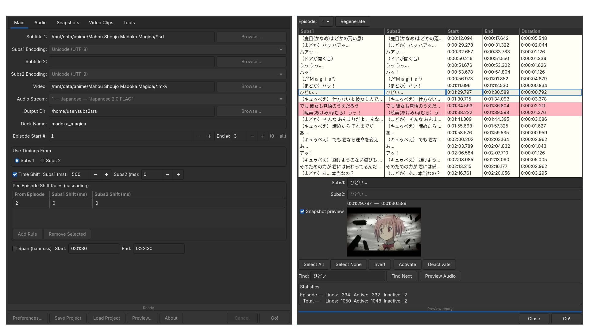

# subs2srs (GTK3 port)

[](https://github.com/rpPH4kQocMjkm2Ve/subs2srs-gtk3/actions/workflows/ci.yml)



A tool that creates [Anki](https://apps.ankiweb.net/) flashcards from movies
and TV shows with subtitles, for language learning.

This is a **GTK3 / .NET 10** rewrite of the UI layer.
The processing core (subtitle parsing, ffmpeg calls, SRS generation)
is carried over from the original with minimal changes.

## Credits

- [Christopher Brochtrup](https://sourceforge.net/projects/subs2srs/) — original author
- [erjiang](https://github.com/erjiang/subs2srs) — Linux/Mono port
- [nihil-admirari](https://github.com/nihil-admirari/subs2srs-net48-builds) — updated dependencies

## What changed from the Mono/WinForms version

| Area | Old (erjiang fork) | This port |
|---|---|---|
| UI toolkit | WinForms on Mono | **GTK3** via GtkSharp |
| Runtime | Mono | **.NET 10+** |
| System.Drawing | Required everywhere | **Removed** — `SrsColor`, `FontInfo` used instead |
| Serialization | `BinaryFormatter` | **System.Text.Json** (`ObjectCloner`) |
| Progress dialogs | `BackgroundWorker` + modal `DialogProgress` | **`async/await`** + `IProgressReporter` |
| PropertyGrid (Preferences) | WinForms `PropertyGrid` | **`TreeView`** with editable cells |
| Preview dialog | `BackgroundWorker` (deadlocked on Wayland) | **`Task.Run` + `async`** |
| Font/Color pickers | WinForms dialogs | **`FontButton` / `ColorButton`** (native GTK) |
| VobSub support | Built-in | **Optional** (compile with `EnableVobSub=true`) |
| MS fonts | Required fontconfig workaround | **Not needed** |
| Build system | mcs / xbuild | **`dotnet publish`** via Makefile |

### Removed components

- **SubsReTimer** — separate tool, not part of this port
- **DialogAbout** — removed (was WinForms bitmap-based)
- **DialogPreviewSnapshot** — merged into `DialogPreview`
- **DialogVideoDimensionsChooser** — removed (size set directly in settings)
- **GroupBoxCheck** — WinForms custom control, not needed in GTK

## Dependencies

**Runtime:**
- [.NET 10+](https://dotnet.microsoft.com/) runtime
- [GTK 3](https://gtk.org/)
- [ffmpeg](https://ffmpeg.org/)
- [mp3gain](https://mp3gain.sourceforge.net/) *(only if using audio normalization)*
- [mkvtoolnix](https://mkvtoolnix.download/) (`mkvextract`, `mkvinfo`) *(only for MKV track extraction)*

**Build:**
- [.NET 10+ SDK](https://dotnet.microsoft.com/)

**Optional:**
- [noto-fonts-cjk](https://github.com/notofonts/noto-cjk) — for Japanese/Chinese/Korean text

## Build

```sh
make build
```

## Test
```sh
make test
```

## Install

### AUR

```sh
yay -S subs2srs-gtk3-git
```

### gitpkg
```sh
gitpkg install subs2srs-gtk3
```

### Manual

```sh
git clone https://gitlab.com/fkzys/subs2srs-gtk3.git
cd subs2srs-gtk3
sudo make install
```

Installs to `/usr/lib/subs2srs/`, launcher to `/usr/bin/subs2srs`.

### Uninstall

```sh
sudo make uninstall
```

## Configuration

On first run, `preferences.txt` is created in
`~/.config/subs2srs/` (or `$XDG_CONFIG_HOME/subs2srs/`).

Edit via **Preferences** dialog or manually.

### Adding a new preference

1. Add entry to `PrefIO.writeDefaultPreferences()`
2. Add default constant to `PrefDefaults`
3. Add mutable property to `ConstantSettings`
4. Add read logic to `PrefIO.read()`
5. Add to `DialogPref.BuildPropTable()`
6. Add to `DialogPref.SavePreferences()`
7. Add to `Logger.writeSettingsToLog()`
8. If the preference maps to `Settings.Instance`, add to `SaveSettings` constructor

### Parallelism

Set `max_parallel_tasks` in Preferences → Misc (or in `preferences.txt`):
- `0` — auto (number of CPU cores, default)
- `1` — sequential (no parallelism)
- `N` — use up to N threads for media generation

## Building with VobSub support

VobSub (`.sub`/`.idx`) parsing requires `System.Drawing.Common` and is
disabled by default. To enable:

```sh
dotnet publish subs2srs/subs2srs.csproj -c Release -p:EnableVobSub=true
```

## License

[GPL-3.0-or-later](https://www.gnu.org/licenses/gpl-3.0.html)
